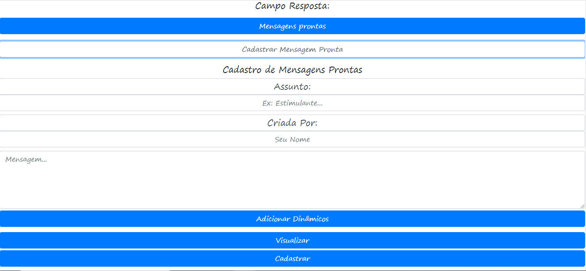
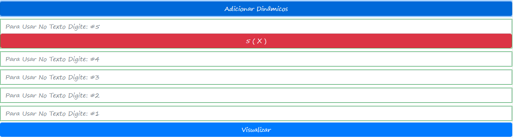
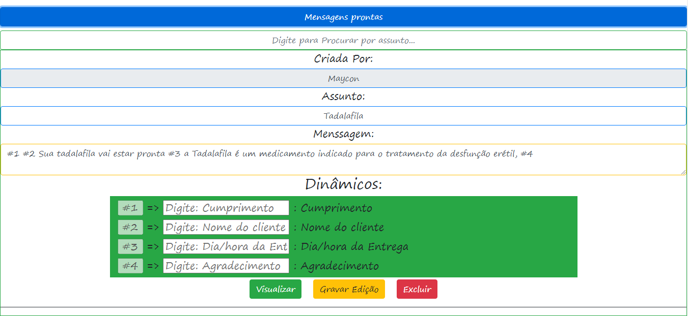
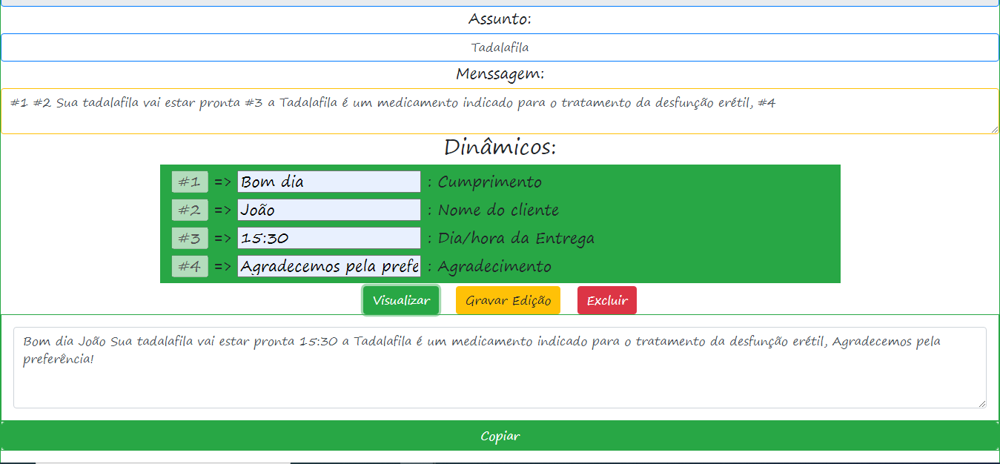

# AutoRespostas
<h1>Respostas automaticas para clientes cadastro, parametros, edicao e copiar mensagens.</h1>

Você nunca teve o sentimento de que estava respondendo a mesma pegunta só que para pessoas diferentes? Então com esse projeto você consegue responder varias pessoas 

<h2>Botões Iniciais</h2>

<h3>Cadastro de mensagens Prontas</h3>

<h4>Cadastro de mensagens Prontas Adicionando dinâmicos</h4>

<h3>Procurando Mensagem Automática</h3>

<h4>Visualizando Mensagem Automática Preenchida</h4>

